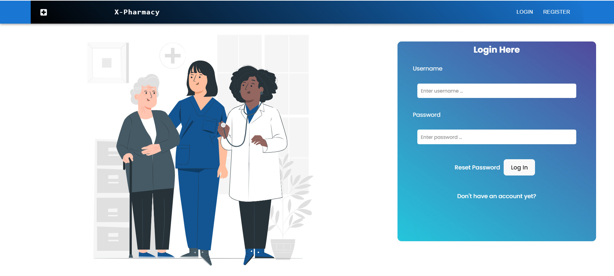
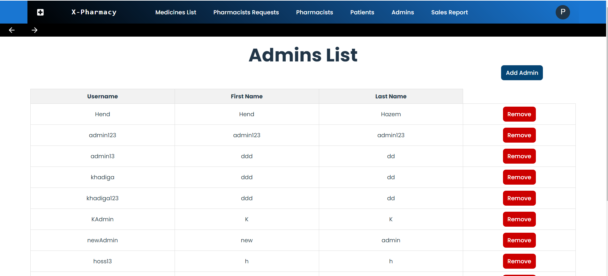
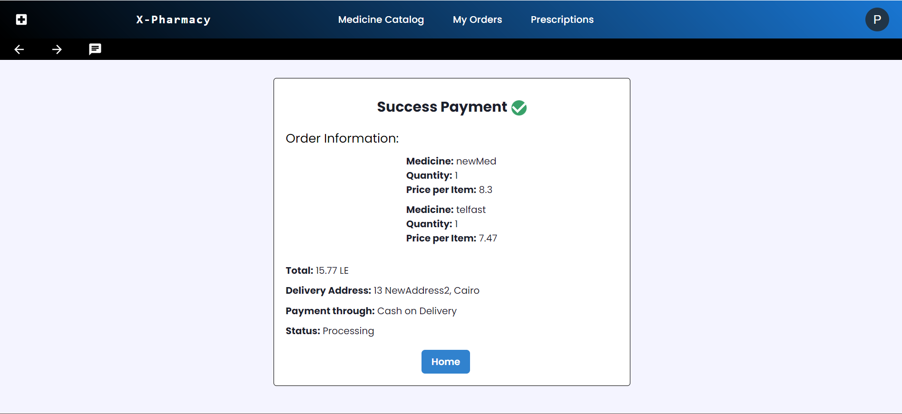
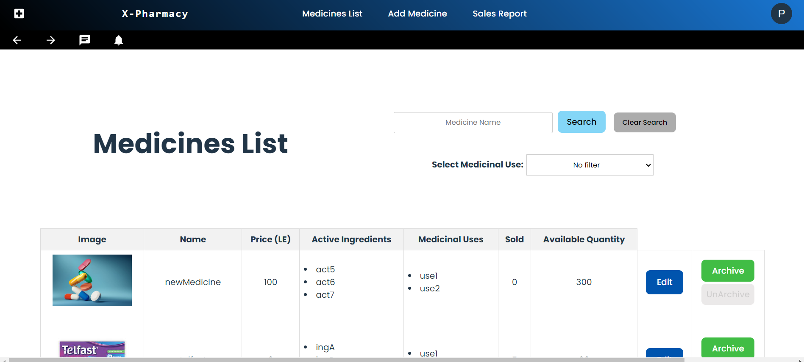
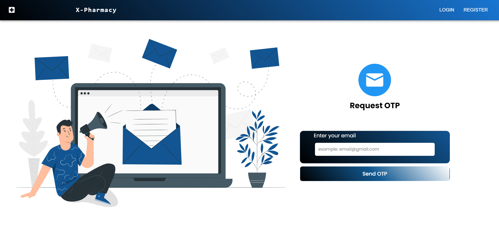
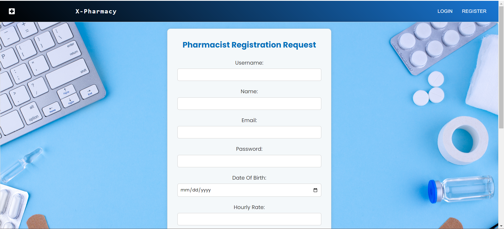

# XTimesBetter-Pharmacy

## Motivation
The XTimesBetter Pharmacy project is driven by the motivation to enhance the efficiency and accessibility of pharmacy services. By leveraging technology, we aim to simplify processes and make pharmaceutical services more user-friendly.

## Build Status
This project does not currently use a continuous integration service. If you encounter any issues during setup, please refer to the installation instructions and feel free to reach out for assistance.

## Code Style
The code style is enforced using eslint and prettier. The code style is enforced using pre-commit hooks and pre-commit github action.


## Screenshots
- 
- 
- 
- 
- 
- 


## Tech/Framework used
- [React.js](https://reactjs.org/) - A JavaScript library for building user interfaces
- [Node.js](https://nodejs.org/) - JavaScript runtime for server-side development
- [Express](https://expressjs.com/) - Fast, unopinionated, minimalist web framework for Node.js
- [MongoDB](https://www.mongodb.com/) - A NoSQL database for storing application data
- [Mongoose](https://mongoosejs.com/) - Elegant MongoDB object modeling for Node.js
- [Axios](https://axios-http.com/) - Promise-based HTTP client for the browser and Node.js
- [React Router](https://reactrouter.com/) - Declarative routing for React.js applications

## Features
###  Registration and Login
1. **User Registration:**
   - Users can register for an account, providing necessary information.
   - Account registration ensures secure and personalized access to the pharmacy system.

2. **Patient Login:**
   - Registered users can log in as patients, gaining access to personalized features.

3. **Pharmacist Request:**
   - Pharmacist candidates can submit a request form.
   - Admin reviews and approves qualified requests, creating pharmacist accounts.

### Patient Account
##### *Account Management*
1. **View Profile:**
   - Patients can view and update their profile information.

2. **Change Password:**
   - Users have the option to change their account password for security.

##### *Medicine Ordering*
3. **Medicine List:**
   - Patients can access a comprehensive list of available medicines, including alternatives if a medicine is out of stock. Alternatives are suggested based on active ingredients.

4. **Add to Cart:**
   - Patients can add over-the-counter medicines to their shopping cart.

5. **View Cart:**
   - Users can review the contents of their cart, which may include alternatives for out-of-stock medicines based on active ingredients.

6. **Checkout and Payment:**
    - During checkout, patients can view prices before discount and after discount if subscribed to a package.
   - Patients have the option to choose from existing delivery addresses or add a new address.
   - The checkout process includes a summary of the order before the final payment step.
   - Patients can complete the order by choosing payment methods such as cash on delivery, wallet, or credit card.

##### *Order Management*
7. **View Past Orders:**
    - Patients can access a history of all their past orders.

8. **Cancel Order:**
    - Users can cancel an order if it has not yet been delivered.

##### *Prescription Handling*
9. **Prescription History:**
    - Patients can view a list of prescriptions from clinic visits.

10. **Purchase Prescription:**
    - Patients can choose to buy a prescription, adding it to the cart for purchase.

11. **Customize Prescription Order:**
    - Users have the option to add additional over-the-counter medicines to a prescription order.

12. **Proceed to Checkout with Prescription:**
    - Patients can proceed to checkout with the prescription and any added medicines.

### Pharmacist Account

1. **View Profile:**
   - Pharmacists can view and update their profile information.

2. **Change Password:**
   - Pharmacists have the option to change their account password for security.

3. **View Medicine List:**
   - Pharmacists can access a comprehensive list of medicines, including sales data for each medicine and available quantities.

4. **Archive and Unarchive Medicines:**
   - Pharmacists can choose to archive or unarchive medicines as needed.

5. **Edit Medicine Information:**
   - Pharmacists have the ability to edit the information of existing medicines in the system.

6. **Add New Medicine:**
   - Pharmacists can add new medicines to the system, including relevant details.

7. **Notifications:**
   - Pharmacists receive notifications when a medicine is out of stock or when specific events require their attention.

8. **Total Sales Report:**
   - Pharmacists can generate a total sales report based on a chosen month, providing insights into the pharmacy's performance.

9. **Chat with Patient:**
   - Pharmacists can engage in chat conversations with patients for better communication and assistance.

### Admin Account
##### *Admin Management*
1. **Add Another Admin Account:**
   - Admins have the authority to add another admin account, granting administrative privileges.

2. **Remove User Accounts:**
   - Admins can remove patient accounts, admin accounts, and pharmacist accounts as needed.

##### *Pharmacist Management*
3. **View Pharmacist Requests:**
   - Admins can view incoming pharmacist requests, containing submitted information.

4. **Accept/Reject Pharmacist Requests:**
   - Admins have the ability to review and accept/reject pharmacist requests based on submitted information.
   - Accepted pharmacists become eligible to log in to the system.

##### *Medicine Management*
5. **View Medicines List:**
   - Admins can access a comprehensive list of medicines.

##### *Sales Report*
6. **View Sales Report:**
   - Admins can view  sales report, providing insights into the pharmacy's performance.

## Code Examples
Below are some code snippets to illustrate specific functionalities of the XTimesBetter Pharmacy project:

### Example 1: 
```javascript
const getAlternatives = async (req, res) => {
    const mainActiveIngredient = req.params.actIng
    //console.log(mainActiveIngredient)
    const medicines = await Medicine.find({
        activeIngredients: { $in: [mainActiveIngredient] },
        archived: false,
        availableQuantity: { $gt: 0 } // Only show medicines that are not out of stock
    }).select('name');
    // Extract only the names from the result
    const medicineNames = medicines.map(medicine => medicine.name);
    //console.log(medicineNames)
    res.json({ success: true, message: 'alternatives done', medicineNames });
}
```

### Example 2:
```javascript
const acceptPharmacist = asyncHandler(async (req, res) => {
    const pharmacistId = req.params.id;
    try {
        // Assuming you have a Mongoose model named "Doctor" representing doctors
        const pharmacist = await pharmacistREQsModel.findByIdAndUpdate(pharmacistId, { status: 'accepted' }, { new: true });
        const newPharmacist = await pharmacistModel.create({
            username: pharmacist.username,
            name: pharmacist.name,
            email: pharmacist.email,
            password: pharmacist.password,
            dob: pharmacist.dob,
            hourly_rate: pharmacist.hourly_rate,
            affiliation: pharmacist.affiliation,
            educational_background: pharmacist.educational_background,
            nationalID:pharmacist.nationalID,
            workingLicense:pharmacist.workingLicense,
            pharmacyDegree:pharmacist.pharmacyDegree
        })

        if (!pharmacist) {
            return res.status(404).json({ message: 'Pharmacist not found' });
        }

        return res.status(200).json({ message: 'Pharmacist request accepted successfully', pharmacist });
    } catch (error) {
        console.error('Error:', error);
        res.status(500).json({ message: 'An error occurred while accepting the request of the pharmacist' });
    }
})
```


## Installation
To set up the XTimesBetter Pharmacy project on your local machine, follow these steps:

### 1. Install Visual Studio Code (VS Code)

Download and install [Visual Studio Code](https://code.visualstudio.com/download) based on your operating system.

### 2. Install Node.js

Visit [nodejs.org](https://nodejs.org/) and download the appropriate version of Node.js for your operating system. Follow the installation instructions provided.

### 3. Install Nodemon

Install Nodemon globally using npm. Open your terminal and run the following command:

```bash
npm install -g nodemon
```
### 4. Install Required Tools and Dependencies
Make sure you have the following tools and dependencies installed on your machine:
1. **Express:**
   - Install Express globally using npm:
     ```bash
     npm install -g express
     ```

2. **Mongoose:**
   - Install Mongoose globally using npm:
     ```bash
     npm install -g mongoose
     ```

3. **React:**
   - Install React globally using npm:
     ```bash
     npm install -g react
     ```

4. **Git:**
   - Install Git globally using npm:
     ```bash
     npm install -g git
     ```

5. **Axios:**
   - Install Axios globally using npm:
     ```bash
     npm install -g axios
     ```

## API Reference
The XTimesBetter Pharmacy API is hosted at the following base URL:

- Base URL: `http://localhost:8000`

### Endpoints
### Authentication Routes
- `/login`: Handles user login.
- `/logout`: Handles user logout.
- `/authentication/checkAccessToken`: Validates user access token.
- `/authentication/getAccessToken`: Retrieves a new access token.
- `/authentication/changePassword`: Allows users to change their password.
- `/resetPassword`: Handles password reset requests.

### Patient Routes
- `/patient/medicineCatalog`: Manages the patient's interaction with the medicine catalog.
- `/patientRoutes`: General patient-related routes.
- `/patient/register`: Handles patient registration.
- `/patient/checkoutAddress`: Manages the patient's checkout address.
- `/patient/pastOrders`: Retrieves information about the patient's past orders.
- `/patient/myCartRoute`: Handles the patient's shopping cart.
- `/patient/myPrescriptionRoute`: Manages the patient's prescriptions.
- `/patient/info`: Retrieves information about the logged-in patient.
- `/patient/paymentCreditCard`, `/patient/paymentWallet`, `/patient/paymentCashOnDelivery`: Handles different payment methods.
- `/patient/viewWalletNumber`: Retrieves the patient's wallet information.
- `/patient/prescriptionDetails`: Manages details related to prescriptions.

### Pharmacist Routes
- `/pharmacist/medicineCatalog`: Manages the pharmacist's interaction with the medicine catalog.
- `/pharmaRoutes`: General pharmacist-related routes.
- `/medicineRoutes`: Routes related to medicines.
- `/pharmacist/register`: Handles pharmacist registration.
- `/pharmacist/info`: Retrieves information about the logged-in pharmacist.
- `/pharmacist/filterSales`: Filters sales data.
- `/pharmacist/viewSales`: Retrieves sales data.
- `/pharmacist/viewWalletNumber`: Retrieves the pharmacist's wallet information.
- `/pharmacist/notifications`: Manages pharmacist notifications.

### Admin Routes
- `/admin/addremove`: Handles addition and removal of admin-related entities.
- `/admin/medicineCatalog`: Manages the medicine catalog from the admin perspective.
- `/admin/viewREQPharmacists`: Retrieves information about requested pharmacist registrations.
- `/admin/info`: Retrieves information about the logged-in admin.
- `/uploads`: Serves uploaded files.
- `/admin/viewSales`: Retrieves sales data from an admin perspective.


## Tests

These tests are performed using [Postman](https://www.postman.com/). Below are examples of API tests:
### Test 1:
- **Route**: `GET /patient/medicineCatalog/alternatives/ingA`
- **Output**:
  ```json
  {
    "success": true,
    "message": "Alternatives retrieved successfully",
    "medicineNames": ["yastest2"]
  }
  ```
### Test 2:
- **Route**: `GET /admin/viewREQPharmacists/accept/6575db8fb04018144b256a81`
- **Output**:
  ```json
    {
    "message": "Pharmacist request accepted successfully",
    "pharmacist": {
        "nationalID": {
            "name": "nationalID-1702222734230.png",
            "path": "..\\server\\uploads\\nationalID-1702222734230.png",
            "contentType": "image/png"
        },
        "workingLicense": {
            "name": "workingLicense-1702222734234.png",
            "path": "..\\server\\uploads\\workingLicense-1702222734234.png",
            "contentType": "image/png"
        },
        "pharmacyDegree": {
            "name": "pharmacyDegree-1702222734236.png",
            "path": "..\\server\\uploads\\pharmacyDegree-1702222734236.png",
            "contentType": "image/png"
        },
        "_id": "6575db8fb04018144b256a81",
        "username": "khadigaNPharma",
        "name": "khadigaNPharma",
        "email": "khadigaNPharma@gmail.com",
        "password": "$2b$10$yDkagYmyxUjq5er0DV9Y0.4u7TUj8/5ybiwpMhVOcxQrD2z6SDOCi",
        "dob": "2006-07-10",
        "hourly_rate": 3000,
        "affiliation": "Pharmacy",
        "educational_background": "PharmD",
        "status": "accepted",
        "createdAt": "2023-12-10T15:38:55.252Z",
        "updatedAt": "2023-12-15T16:43:36.528Z",
        "__v": 0
    }
}
  ```

## How to Use?
Follow these steps to set up and use the XTimesBetter Pharmacy application on your local machine:

### 1. Prerequisites
Make sure you have the following installed on your machine:
- [Visual Studio Code (VS Code)](https://code.visualstudio.com/download)
- [Node.js](https://nodejs.org/)
- [Nodemon](https://www.npmjs.com/package/nodemon) (Installed globally using `npm install -g nodemon`)

### 2. Clone the Repository
```bash
git clone https://github.com/your-username/XTimesBetter-Pharmacy.git
cd XTimesBetter-Pharmacy
```
### 3. Install Dependencies

1. **Server Dependencies:**
   ```bash
   cd server
   npm install
   ```
 2. **Client Dependencies:**
    ```bash
    cd client
    npm install
    ```
### 4. Start Server
To run the XTimesBetter Pharmacy server, execute the following command in the server directory:
   ```bash
   cd server
   npm run dev
   ```
### 5. Start Client
To run the XTimesBetter Pharmacy client, execute the following command in the client directory:
   ```bash
   cd client
   npm run dev
   ```
Now, with both the server and client running, you can access the XTimesBetter Pharmacy application in your web browser at http://localhost:5174. Enjoy exploring our project!

## Contribute
We welcome contributions from the community! If you'd like to contribute to the XTimesBetter Pharmacy project, please follow these guidelines:

### Getting Started
1. Fork the repository and clone it to your local machine.
2. Create a new branch for your contribution: `git checkout -b feature/your-feature-name`.
3. Make your changes and ensure that the code follows our coding standards.

### Code Standards
- Follow the existing coding style and conventions.
- Write clear and concise commit messages.
- Keep your changes focused and avoid unrelated changes in a single pull request.

### Submitting Changes
1. Push your changes to your forked repository.
2. Create a pull request from your branch to the main repository's `Sprint3` branch.

### Reporting Issues

If you encounter any bugs or issues, please open a GitHub issue. Provide detailed information about the problem and steps to reproduce it.

### Feature Requests

If you have a feature request, open a GitHub issue and describe the feature you'd like to see. We appreciate your input!


By contributing, you agree that your contributions will be licensed under our `License` section
Thank you for contributing to XTimesBetter Pharmacy! 🚀

## Credits
- https://youtu.be/98BzS5Oz5E4?si=EEcNcKYBLNBR5ZlU
- https://www.atatus.com/blog/how-to-perform-http-requests-with-axios-a-complete-guide/#:~:text=Axios
- https://youtu.be/1r-F3FIONl8

## License
- **[Stripe](https://stripe.com):**
  - License: [Apache 2.0 License](https://opensource.org/licenses/Apache-2.0)